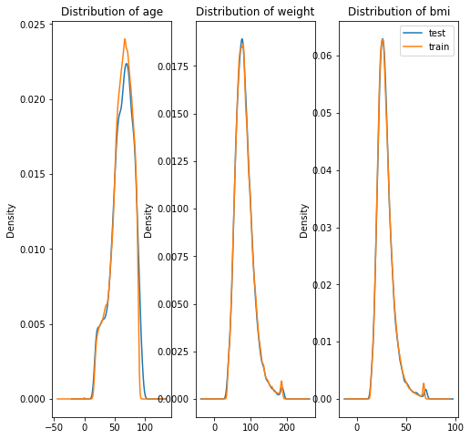
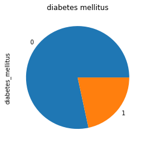
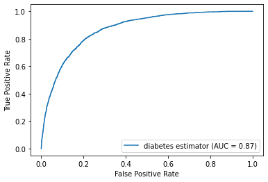
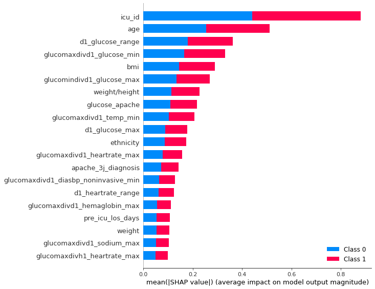
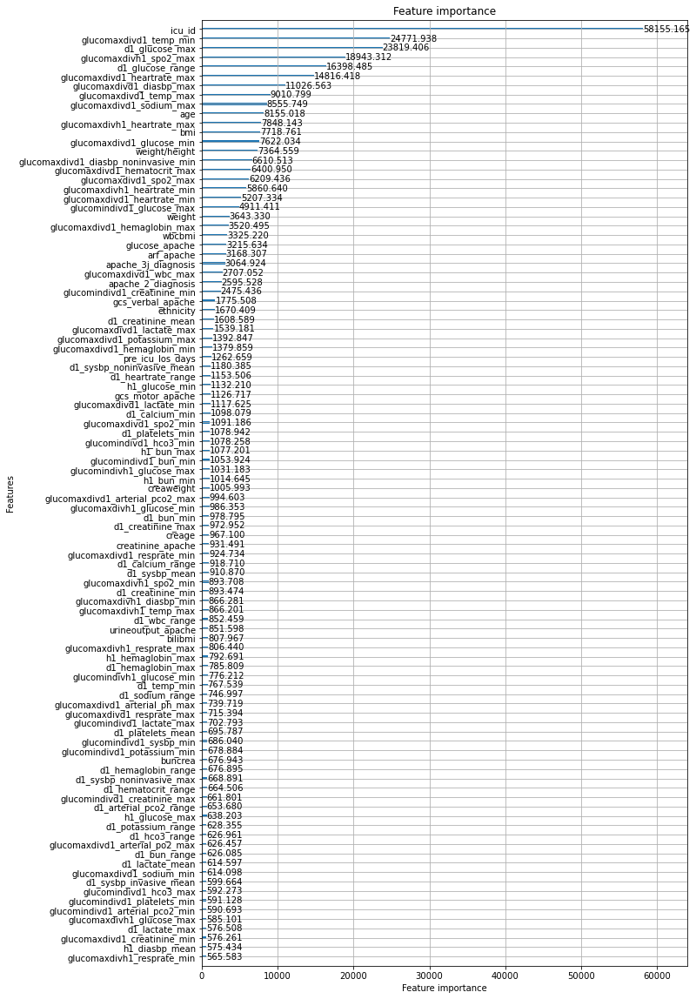
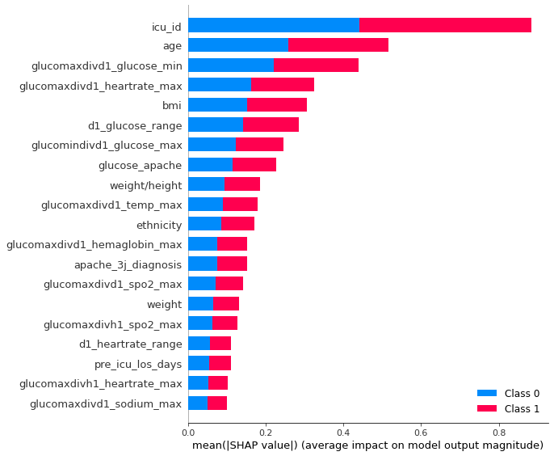
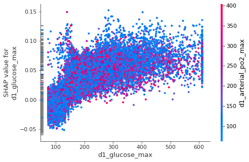
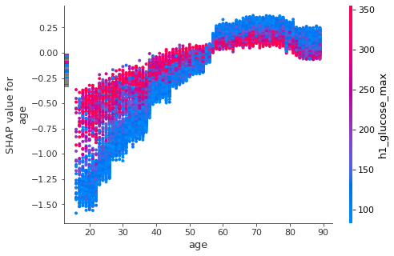
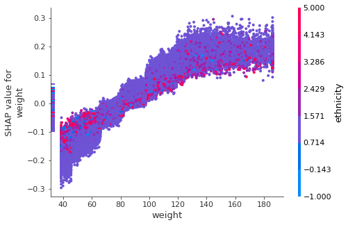

## Notes

1.	State the idea: women in data science, the hackathon, and Kaggle
2.	State the problem: predicting diabetes in ICU patients – classification problem
3.	Introduce the data: some categorical and some (?). from blood tests
Show some data set statistics, mention train and test-set differences (i.e. ICU-IDs)
4.	Explain the general setup: splitting into train, test and validation set.
5.	Explain model choice: why is light-gbm good (for Kaggle and otherwise)
6.	Explain how to make the model good: create lots of variables
7.	(explain some pathes that did not work much: i.e feature imputation)
8.	Explain Bayesian hyperparameter tuning. Why is it necessary?
9.	Make the model explainable: how does it work? Does it use useful features?
10.	(maybe: talk about model fairness: is the dataset unbiased? How does that lead to accuracy for different groups)
11.	Feature selection and final result.
Mehr text, weniger code.. und dann notebook zum runterladen zur verfuegung stellen.


## WiDS Datathon Maastrich 2021

BDSI took part in this year's [WiDS datathon from Maastrich university.]( https://www.maastrichtuniversity.nl/events/wids-datathon-maastricht-2021)
A Datathon is, similar to a Hackathon, a weekend-long competition where you are challenged to solve problems with code.
The prolems in a datathon are from different areas of Machine Learning, AI, and Data Science. 
The competition was part of a larger challenge hosted on [kaggle.](https://www.kaggle.com/c/widsdatathon2021)
We came up first among the participants of the Maastricht Datathon and want to share our solution here. 
If you want to run or experiment with the data yourself, you can try downloading the data from Kaggle.
This Notebook can be downloaded here:

This year's challenge was about predicting diabetes in intensive care patients.
From the Competition description:
> "Getting a rapid understanding of the context of a patient’s overall health has been particularly important during the COVID-19 pandemic as healthcare workers around the world struggle with hospitals overloaded by patients in critical condition. Intensive Care Units (ICUs) often lack verified medical histories for incoming patients. A patient in distress or a patient who is brought in confused or unresponsive may not be able to provide information about chronic conditions such as heart disease, injuries, or diabetes. Medical records may take days to transfer, especially for a patient from another medical provider or system.
>Knowledge about chronic conditions such as diabetes can inform clinical decisions about patient care and ultimately improve patient outcomes. This year's challenge will focus on models to determine whether a patient admitted to an ICU has been diagnosed with a particular type of diabetes, Diabetes Mellitus, using data from the first 24 hours of intensive care"


```python
import warnings
warnings.filterwarnings('ignore')

import numpy as np
import seaborn as sns

```

## The data


The data has ~130000 entries and almost 180 columns to use as features. Each row corresponds to one patient. The task is to predict whether or not a patient has diabetes, given the information in the feature columns.
The features can be sorted into several subgroups:
* data characterizing the patient like: age, gender, ethnicity, height, weight and bmi
* data about known diseases and complications, that the patient has. These are identifers, i.e. if the patient has aids, hepatic_failure, leukemia, etc
* data from the first examinations, including heart-rate, blood pressure and blood tests in the first hour and on the first day. These are max and min values
* data from the [APACHE scoring system] (https://en.wikipedia.org/wiki/APACHE_II), which includes data from the first examination.
* data related to the hospital, the type of icu, the patient went to, whether the intervention was planned and where the patient was before the ICU. 

The data has many missing values. In particular, not every patient has gone through the exam and blood tests in the first hour, but also other measures have not been taken equally for all patients.     


```python
import pandas as pd
df = pd.read_csv('TrainingWiDS2021.csv', index_col=0)
df_pred = pd.read_csv('UnlabeledWiDS2021.csv', index_col=0)

print('train data:', df.shape, 'test data:', df_pred.shape)
df.head()
```

    train data: (130157, 180) test data: (10234, 179)


<div>
<style scoped>
    .dataframe tbody tr th:only-of-type {
        vertical-align: middle;
    }

    .dataframe tbody tr th {
        vertical-align: top;
    }

    .dataframe thead th {
        text-align: right;
    }
</style>
<table border="1" class="dataframe">
  <thead>
    <tr style="text-align: right;">
      <th></th>
      <th>encounter_id</th>
      <th>hospital_id</th>
      <th>age</th>
      <th>bmi</th>
      <th>elective_surgery</th>
      <th>ethnicity</th>
      <th>gender</th>
      <th>height</th>
      <th>hospital_admit_source</th>
      <th>icu_admit_source</th>
      <th>...</th>
      <th>h1_pao2fio2ratio_max</th>
      <th>h1_pao2fio2ratio_min</th>
      <th>aids</th>
      <th>cirrhosis</th>
      <th>hepatic_failure</th>
      <th>immunosuppression</th>
      <th>leukemia</th>
      <th>lymphoma</th>
      <th>solid_tumor_with_metastasis</th>
      <th>diabetes_mellitus</th>
    </tr>
  </thead>
  <tbody>
    <tr>
      <th>1</th>
      <td>214826</td>
      <td>118</td>
      <td>68.0</td>
      <td>22.732803</td>
      <td>0</td>
      <td>Caucasian</td>
      <td>M</td>
      <td>180.3</td>
      <td>Floor</td>
      <td>Floor</td>
      <td>...</td>
      <td>NaN</td>
      <td>NaN</td>
      <td>0</td>
      <td>0</td>
      <td>0</td>
      <td>0</td>
      <td>0</td>
      <td>0</td>
      <td>0</td>
      <td>1</td>
    </tr>
    <tr>
      <th>2</th>
      <td>246060</td>
      <td>81</td>
      <td>77.0</td>
      <td>27.421875</td>
      <td>0</td>
      <td>Caucasian</td>
      <td>F</td>
      <td>160.0</td>
      <td>Floor</td>
      <td>Floor</td>
      <td>...</td>
      <td>51.0</td>
      <td>51.0</td>
      <td>0</td>
      <td>0</td>
      <td>0</td>
      <td>0</td>
      <td>0</td>
      <td>0</td>
      <td>0</td>
      <td>1</td>
    </tr>
    <tr>
      <th>3</th>
      <td>276985</td>
      <td>118</td>
      <td>25.0</td>
      <td>31.952749</td>
      <td>0</td>
      <td>Caucasian</td>
      <td>F</td>
      <td>172.7</td>
      <td>Emergency Department</td>
      <td>Accident &amp; Emergency</td>
      <td>...</td>
      <td>NaN</td>
      <td>NaN</td>
      <td>0</td>
      <td>0</td>
      <td>0</td>
      <td>0</td>
      <td>0</td>
      <td>0</td>
      <td>0</td>
      <td>0</td>
    </tr>
    <tr>
      <th>4</th>
      <td>262220</td>
      <td>118</td>
      <td>81.0</td>
      <td>22.635548</td>
      <td>1</td>
      <td>Caucasian</td>
      <td>F</td>
      <td>165.1</td>
      <td>Operating Room</td>
      <td>Operating Room / Recovery</td>
      <td>...</td>
      <td>337.0</td>
      <td>337.0</td>
      <td>0</td>
      <td>0</td>
      <td>0</td>
      <td>0</td>
      <td>0</td>
      <td>0</td>
      <td>0</td>
      <td>0</td>
    </tr>
    <tr>
      <th>5</th>
      <td>201746</td>
      <td>33</td>
      <td>19.0</td>
      <td>NaN</td>
      <td>0</td>
      <td>Caucasian</td>
      <td>M</td>
      <td>188.0</td>
      <td>NaN</td>
      <td>Accident &amp; Emergency</td>
      <td>...</td>
      <td>NaN</td>
      <td>NaN</td>
      <td>0</td>
      <td>0</td>
      <td>0</td>
      <td>0</td>
      <td>0</td>
      <td>0</td>
      <td>0</td>
      <td>0</td>
    </tr>
  </tbody>
</table>
<p>5 rows × 180 columns</p>
</div>


```python
y_df = df['diabetes_mellitus']
df = df.drop(columns=['diabetes_mellitus'])
def highlight_nas(s):
    '''
    highlight values above 0.5 in a Series yellow.
    '''
    is_max = s > 0.5
    return ['background-color: yellow' if v else '' for v in is_max]

dftypes = pd.DataFrame(df.dtypes.rename('type'))
dftypes['isnull'] = df.isnull().mean()
dftypes['unique'] = df.nunique()
dftypes['corr'] = df.corrwith(y_df)
dftypes['abs_corr'] = dftypes['corr'].apply(abs)
dftypes.sort_values(by='abs_corr', ascending=False)[['type','isnull','unique','corr']][0:15]\
        .style.apply(highlight_nas, subset=['isnull'])
```


<style  type="text/css" >
#T_92f05_row2_col1,#T_92f05_row3_col1,#T_92f05_row10_col1,#T_92f05_row11_col1{
            background-color:  yellow;
        }</style><table id="T_92f05_" ><thead>    <tr>        <th class="blank level0" ></th>        <th class="col_heading level0 col0" >type</th>        <th class="col_heading level0 col1" >isnull</th>        <th class="col_heading level0 col2" >unique</th>        <th class="col_heading level0 col3" >corr</th>    </tr></thead><tbody>
                <tr>
                        <th id="T_92f05_level0_row0" class="row_heading level0 row0" >d1_glucose_max</th>
                        <td id="T_92f05_row0_col0" class="data row0 col0" >float64</td>
                        <td id="T_92f05_row0_col1" class="data row0 col1" >0.063331</td>
                        <td id="T_92f05_row0_col2" class="data row0 col2" >538</td>
                        <td id="T_92f05_row0_col3" class="data row0 col3" >0.400742</td>
            </tr>
            <tr>
                        <th id="T_92f05_level0_row1" class="row_heading level0 row1" >glucose_apache</th>
                        <td id="T_92f05_row1_col0" class="data row1 col0" >float64</td>
                        <td id="T_92f05_row1_col1" class="data row1 col1" >0.112910</td>
                        <td id="T_92f05_row1_col2" class="data row1 col2" >566</td>
                        <td id="T_92f05_row1_col3" class="data row1 col3" >0.354359</td>
            </tr>
            <tr>
                        <th id="T_92f05_level0_row2" class="row_heading level0 row2" >h1_glucose_max</th>
                        <td id="T_92f05_row2_col0" class="data row2 col0" >float64</td>
                        <td id="T_92f05_row2_col1" class="data row2 col1" >0.576788</td>
                        <td id="T_92f05_row2_col2" class="data row2 col2" >612</td>
                        <td id="T_92f05_row2_col3" class="data row2 col3" >0.316847</td>
            </tr>
            <tr>
                        <th id="T_92f05_level0_row3" class="row_heading level0 row3" >h1_glucose_min</th>
                        <td id="T_92f05_row3_col0" class="data row3 col0" >float64</td>
                        <td id="T_92f05_row3_col1" class="data row3 col1" >0.576788</td>
                        <td id="T_92f05_row3_col2" class="data row3 col2" >604</td>
                        <td id="T_92f05_row3_col3" class="data row3 col3" >0.304520</td>
            </tr>
            <tr>
                        <th id="T_92f05_level0_row4" class="row_heading level0 row4" >bmi</th>
                        <td id="T_92f05_row4_col0" class="data row4 col0" >float64</td>
                        <td id="T_92f05_row4_col1" class="data row4 col1" >0.034497</td>
                        <td id="T_92f05_row4_col2" class="data row4 col2" >41453</td>
                        <td id="T_92f05_row4_col3" class="data row4 col3" >0.169043</td>
            </tr>
            <tr>
                        <th id="T_92f05_level0_row5" class="row_heading level0 row5" >weight</th>
                        <td id="T_92f05_row5_col0" class="data row5 col0" >float64</td>
                        <td id="T_92f05_row5_col1" class="data row5 col1" >0.026606</td>
                        <td id="T_92f05_row5_col2" class="data row5 col2" >3636</td>
                        <td id="T_92f05_row5_col3" class="data row5 col3" >0.155517</td>
            </tr>
            <tr>
                        <th id="T_92f05_level0_row6" class="row_heading level0 row6" >d1_bun_max</th>
                        <td id="T_92f05_row6_col0" class="data row6 col0" >float64</td>
                        <td id="T_92f05_row6_col1" class="data row6 col1" >0.105519</td>
                        <td id="T_92f05_row6_col2" class="data row6 col2" >494</td>
                        <td id="T_92f05_row6_col3" class="data row6 col3" >0.146990</td>
            </tr>
            <tr>
                        <th id="T_92f05_level0_row7" class="row_heading level0 row7" >bun_apache</th>
                        <td id="T_92f05_row7_col0" class="data row7 col0" >float64</td>
                        <td id="T_92f05_row7_col1" class="data row7 col1" >0.195233</td>
                        <td id="T_92f05_row7_col2" class="data row7 col2" >476</td>
                        <td id="T_92f05_row7_col3" class="data row7 col3" >0.145241</td>
            </tr>
            <tr>
                        <th id="T_92f05_level0_row8" class="row_heading level0 row8" >d1_bun_min</th>
                        <td id="T_92f05_row8_col0" class="data row8 col0" >float64</td>
                        <td id="T_92f05_row8_col1" class="data row8 col1" >0.105519</td>
                        <td id="T_92f05_row8_col2" class="data row8 col2" >471</td>
                        <td id="T_92f05_row8_col3" class="data row8 col3" >0.137304</td>
            </tr>
            <tr>
                        <th id="T_92f05_level0_row9" class="row_heading level0 row9" >d1_glucose_min</th>
                        <td id="T_92f05_row9_col0" class="data row9 col0" >float64</td>
                        <td id="T_92f05_row9_col1" class="data row9 col1" >0.063331</td>
                        <td id="T_92f05_row9_col2" class="data row9 col2" >256</td>
                        <td id="T_92f05_row9_col3" class="data row9 col3" >0.135848</td>
            </tr>
            <tr>
                        <th id="T_92f05_level0_row10" class="row_heading level0 row10" >h1_bun_min</th>
                        <td id="T_92f05_row10_col0" class="data row10 col0" >float64</td>
                        <td id="T_92f05_row10_col1" class="data row10 col1" >0.806641</td>
                        <td id="T_92f05_row10_col2" class="data row10 col2" >259</td>
                        <td id="T_92f05_row10_col3" class="data row10 col3" >0.135157</td>
            </tr>
            <tr>
                        <th id="T_92f05_level0_row11" class="row_heading level0 row11" >h1_bun_max</th>
                        <td id="T_92f05_row11_col0" class="data row11 col0" >float64</td>
                        <td id="T_92f05_row11_col1" class="data row11 col1" >0.806641</td>
                        <td id="T_92f05_row11_col2" class="data row11 col2" >259</td>
                        <td id="T_92f05_row11_col3" class="data row11 col3" >0.134985</td>
            </tr>
            <tr>
                        <th id="T_92f05_level0_row12" class="row_heading level0 row12" >d1_creatinine_max</th>
                        <td id="T_92f05_row12_col0" class="data row12 col0" >float64</td>
                        <td id="T_92f05_row12_col1" class="data row12 col1" >0.101977</td>
                        <td id="T_92f05_row12_col2" class="data row12 col2" >1247</td>
                        <td id="T_92f05_row12_col3" class="data row12 col3" >0.127929</td>
            </tr>
            <tr>
                        <th id="T_92f05_level0_row13" class="row_heading level0 row13" >d1_creatinine_min</th>
                        <td id="T_92f05_row13_col0" class="data row13 col0" >float64</td>
                        <td id="T_92f05_row13_col1" class="data row13 col1" >0.101977</td>
                        <td id="T_92f05_row13_col2" class="data row13 col2" >1147</td>
                        <td id="T_92f05_row13_col3" class="data row13 col3" >0.125828</td>
            </tr>
            <tr>
                        <th id="T_92f05_level0_row14" class="row_heading level0 row14" >creatinine_apache</th>
                        <td id="T_92f05_row14_col0" class="data row14 col0" >float64</td>
                        <td id="T_92f05_row14_col1" class="data row14 col1" >0.191169</td>
                        <td id="T_92f05_row14_col2" class="data row14 col2" >1198</td>
                        <td id="T_92f05_row14_col3" class="data row14 col3" >0.124891</td>
            </tr>
    </tbody></table>


```python
test_id = df_pred['encounter_id']


train_size = df.shape[0]
test_size = df_pred.shape[0]
X = pd.concat([df, df_pred], axis=0)
X = X.drop(columns=['encounter_id','hospital_id'])
X.head()
```


<div>
<style scoped>
    .dataframe tbody tr th:only-of-type {
        vertical-align: middle;
    }

    .dataframe tbody tr th {
        vertical-align: top;
    }

    .dataframe thead th {
        text-align: right;
    }
</style>
<table border="1" class="dataframe">
  <thead>
    <tr style="text-align: right;">
      <th></th>
      <th>age</th>
      <th>bmi</th>
      <th>elective_surgery</th>
      <th>ethnicity</th>
      <th>gender</th>
      <th>height</th>
      <th>hospital_admit_source</th>
      <th>icu_admit_source</th>
      <th>icu_id</th>
      <th>icu_stay_type</th>
      <th>...</th>
      <th>h1_arterial_po2_min</th>
      <th>h1_pao2fio2ratio_max</th>
      <th>h1_pao2fio2ratio_min</th>
      <th>aids</th>
      <th>cirrhosis</th>
      <th>hepatic_failure</th>
      <th>immunosuppression</th>
      <th>leukemia</th>
      <th>lymphoma</th>
      <th>solid_tumor_with_metastasis</th>
    </tr>
  </thead>
  <tbody>
    <tr>
      <th>1</th>
      <td>68.0</td>
      <td>22.732803</td>
      <td>0</td>
      <td>Caucasian</td>
      <td>M</td>
      <td>180.3</td>
      <td>Floor</td>
      <td>Floor</td>
      <td>92</td>
      <td>admit</td>
      <td>...</td>
      <td>NaN</td>
      <td>NaN</td>
      <td>NaN</td>
      <td>0</td>
      <td>0</td>
      <td>0</td>
      <td>0</td>
      <td>0</td>
      <td>0</td>
      <td>0</td>
    </tr>
    <tr>
      <th>2</th>
      <td>77.0</td>
      <td>27.421875</td>
      <td>0</td>
      <td>Caucasian</td>
      <td>F</td>
      <td>160.0</td>
      <td>Floor</td>
      <td>Floor</td>
      <td>90</td>
      <td>admit</td>
      <td>...</td>
      <td>51.0</td>
      <td>51.0</td>
      <td>51.0</td>
      <td>0</td>
      <td>0</td>
      <td>0</td>
      <td>0</td>
      <td>0</td>
      <td>0</td>
      <td>0</td>
    </tr>
    <tr>
      <th>3</th>
      <td>25.0</td>
      <td>31.952749</td>
      <td>0</td>
      <td>Caucasian</td>
      <td>F</td>
      <td>172.7</td>
      <td>Emergency Department</td>
      <td>Accident &amp; Emergency</td>
      <td>93</td>
      <td>admit</td>
      <td>...</td>
      <td>NaN</td>
      <td>NaN</td>
      <td>NaN</td>
      <td>0</td>
      <td>0</td>
      <td>0</td>
      <td>0</td>
      <td>0</td>
      <td>0</td>
      <td>0</td>
    </tr>
    <tr>
      <th>4</th>
      <td>81.0</td>
      <td>22.635548</td>
      <td>1</td>
      <td>Caucasian</td>
      <td>F</td>
      <td>165.1</td>
      <td>Operating Room</td>
      <td>Operating Room / Recovery</td>
      <td>92</td>
      <td>admit</td>
      <td>...</td>
      <td>265.0</td>
      <td>337.0</td>
      <td>337.0</td>
      <td>0</td>
      <td>0</td>
      <td>0</td>
      <td>0</td>
      <td>0</td>
      <td>0</td>
      <td>0</td>
    </tr>
    <tr>
      <th>5</th>
      <td>19.0</td>
      <td>NaN</td>
      <td>0</td>
      <td>Caucasian</td>
      <td>M</td>
      <td>188.0</td>
      <td>NaN</td>
      <td>Accident &amp; Emergency</td>
      <td>91</td>
      <td>admit</td>
      <td>...</td>
      <td>NaN</td>
      <td>NaN</td>
      <td>NaN</td>
      <td>0</td>
      <td>0</td>
      <td>0</td>
      <td>0</td>
      <td>0</td>
      <td>0</td>
      <td>0</td>
    </tr>
  </tbody>
</table>
<p>5 rows × 177 columns</p>
</div>


### Data Exploration
The first think we want to understand is, whether the distributions of the features are similar for the test data and the training data. If they are, the model will not perform widely different on the testdata, from how it performs on the training data. We check for a few features, and it looks promising. 

The distribution of the target variable is skewed. Many more people are healthy than diabetic. 


```python
import matplotlib.pyplot as plt
X['dataset']='train'
X['dataset'].iloc[train_size:]='test'
fig, ax = plt.subplots(1,3, figsize=(8,8))
X.groupby(['dataset'])['age'].plot.kde(title='Distribution of age', ax=ax[0])
X.groupby(['dataset'])['weight'].plot.kde(title='Distribution of weight', ax=ax[1])
X.groupby(['dataset'])['bmi'].plot.kde(title='Distribution of bmi', ax=ax[2])#, ind=50)

X.drop(columns=['dataset'],inplace=True)
plt.legend()
plt.show()
```





```python
y_df.value_counts().plot.pie(title='diabetes mellitus')
```


    <AxesSubplot:title={'center':'diabetes mellitus'}, ylabel='diabetes_mellitus'>





#### Data Pre-processing
we will encode the categorical data. Some of the categories are only in the training set and some are only in the test set. Since here we know exactly what data will be in the test set, we can drop all categories that appear either only in the test or only in the training set, because they will not be relevant for training the model and predicting. If we could get different test set data at a later point, this would not be a useful thing to do. But in this scenario, it will reduce unnecessary information and help to improve model evaluation.
Furthermore, we will drop the 'readmission_status' variable, as it has the same entry everywhere, and set 'encounter_id' as index.


```python
hospital_categorical = ['hospital_admit_source','icu_admit_source','icu_stay_type','icu_type','icu_id']
diseases = ['aids', 'cirrhosis','hepatic_failure', 'immunosuppression', 'leukemia','lymphoma','solid_tumor_with_metastasis']
personal_categorical = ['gender','ethnicity']
cat_features = hospital_categorical+diseases+personal_categorical
```


```python
for col in cat_features:
    cats_train = set(X[col].iloc[:train_size].unique())
    cats_test = set(X[col].iloc[train_size:].unique())
    categories = cats_train.intersection(cats_test)
    categories = [k for k in categories if k==k] #nan is never equal to itself :) 
    print(col, cats_train.difference(cats_test), cats_test.difference(cats_train))

    X[col] = pd.Categorical(X[col], categories=categories).reorder_categories(categories)
    X[col] = X[col].cat.codes
  
```

    hospital_admit_source {'Observation', 'PACU', 'Other', 'Acute Care/Floor', 'ICU'} set()
    icu_admit_source set() set()
    icu_stay_type set() set()
    icu_type set() set()
    icu_id {636, 641, 135, 650, 907, 398, 654, 1048, 417, 677, 424, 425, 170, 426, 427, 428, 174, 302, 176, 429, 430, 431, 432, 556, 1076, 823, 312, 956, 830, 195, 970, 971, 335, 976, 338, 978, 468, 470, 471, 984, 89, 474, 552, 603, 989, 862, 479, 480, 482, 997, 230, 365, 366, 493, 494, 241, 242, 498, 1010, 634, 248, 377, 506, 252} {899, 900, 901, 269, 912, 147, 924, 544, 162, 931, 166, 934, 935, 941, 436, 443, 446, 447, 1093, 453, 1095, 456, 713, 1098, 716, 1101, 720, 465, 723, 724, 725, 726, 728, 729, 351, 101, 361, 1003}
    aids set() set()
    cirrhosis set() set()
    hepatic_failure set() set()
    immunosuppression set() set()
    leukemia set() set()
    lymphoma set() set()
    solid_tumor_with_metastasis set() set()
    gender set() set()
    ethnicity set() set()


## The Model
The choice of the model in this case was quite easy. There was a lot of data, with lots of features and a binary classification problem.
Gradient boosted tree models work quite well in this case. As they state on their website: “LightGBM is being widely-used in many winning solutions of machine learning competitions”. And rightfully so.
In particular, the hackathon was aimed at just two days. LightGBM saves a lot of hassle of data treatment. It can handle the many NAs, does not need rescaling of the data (it's based on decision trees), does not need one-hot encoding of features and we do not need to care about correlated features. 
It is fast and efficient in memory and sports some other nice extras like growing its trees leaf-wise instead of row-wise and using an optimized histogram-based decision tree learning algorithm, both of which is more efficient. 
find model that is flexible and can handle lots of new features.


### Feature Creation
As a general rule, with decision tree based models, it's really helpful to create lots of features. Those that are not helpful can be filtered out again later. 
In the end, at some point, we had increased features by 5 fold. Unlike with linear models, adding or subtracting features can create additional value. For each features, the decision tree needs to find the optimal splitting point.
When two features are related, the optimal split point of one feature can depend on the value of the second feature, so it will not be the same for all entries. Creating features, who's optimal splitting point is independent of other features will facilitate the modeling. 
There are different ways to come up with new features. You can try to understand which features could make sense and create those, you can just randomly create lots of features and then select the ones that improve the model or you can try to understand which features in the dataset have high predictive power and try to combine those with other.
We did a bit of all of this.
First we tried to understand the health exam features.
Many of the examination values change over time. Some of them have diurnal patterns. Blood sugar, for example, depends highly on when someone has last eaten. We only have maximum and minimum values and no time of day or other information. 
So we create the average and the range given the maximum and minimum values.
Furthermore, we try to understand which values depend on each other, and create features that take this dependence into account.


```python

lab_col = [c for c in X.columns if((c.startswith("h1")) | (c.startswith("d1")))]

for col in lab_col:
    X['glucomaxdiv'+col] = X['d1_glucose_max']/X[col]
    X['glucomindiv'+col] = X['d1_glucose_min']/X[col]
    if col.endswith('max'):
        X[col[:-4]+'_range'] = X[col]-X[col[:-4]+'_min']
        X[col[:-4]+'_mean'] = (X[col]+X[col[:-4]+'_min'])/2
       
    
```


```python
def relate_to_meanweight(X_df, col, colnew):
   
    albucol = X_df.groupby('weightgroup')[col].mean()
    X_df[colnew] = np.nan
    cond = ~X_df[col].isnull()& ~X_df.weightgroup.isnull()
    X_df[colnew][cond] = X_df[cond][[col,'weightgroup']].apply(lambda x: x[col]/albucol.loc[x['weightgroup']], axis=1)
    return X_df

def relate_to_medianage(X_df, col, colnew):
   
    albucol = X_df.groupby('age')[col].median()
    X_df[colnew] = np.nan
    cond = ~X_df[col].isnull()& ~X_df.age.isnull()
    X_df[colnew][cond] = X_df[cond][[col,'age']].apply(lambda x: x[col]/albucol.loc[x['age']], axis=1)
    return X_df

```


```python

def get_extra_cols(X_df):
    X_df = relate_to_medianage(X_df, 'd1_albumin_mean','albuage')
    X_df = relate_to_medianage(X_df, 'd1_creatinine_mean','creage')
    X_df = relate_to_medianage(X_df, 'd1_glucose_mean','glucoage')
    #X_df['albuweight'] = X_df['d1_albumin_mean']/X_df['weight']
    X_df['weightgroup']=pd.cut(X_df.weight,[0,20,30,40,50,60,70,80,140])
    X_df = relate_to_meanweight(X_df, 'd1_albumin_mean','albuweight')
    X_df = relate_to_meanweight(X_df, 'd1_creatinine_mean','creaweight')
    X_df = relate_to_meanweight(X_df, 'd1_glucose_mean','glucoweight')
    X_df['bilibmi'] = X_df['d1_bilirubin_mean']/X_df['bmi']
    X_df['bilialbu'] = X_df['d1_bilirubin_mean']/X_df['d1_albumin_mean']
    X_df['creatibmi'] = X_df['d1_creatinine_mean']/X_df['bmi']
    X_df['creatigluc'] = X_df['d1_creatinine_mean']/X_df['d1_glucose_mean']
    X_df['buncrea'] = X_df['d1_bun_mean']/X_df['d1_creatinine_mean']
    X_df['glucohem'] = X_df['d1_glucose_mean']/X_df['d1_hemaglobin_mean']
    X_df['glucohemo2'] = X_df['d1_glucose_mean']/X_df['d1_hemaglobin_mean']*X_df['d1_hco3_mean']
    X_df['hemoglucocrit'] = X_df['d1_hemaglobin_mean']/X_df['d1_hematocrit_mean']/X_df['d1_glucose_mean']
    X_df['lactoglu'] = X_df['d1_glucose_mean']/X_df['d1_spo2_mean']+X_df['d1_lactate_mean']/X_df['d1_hco3_mean']
    X_df['wbcbmi']=X_df['d1_wbc_mean']/X_df['bmi']
    X_df['weight/height'] = X_df['weight']/X_df['height']
    X_df = X_df.drop(columns=['weightgroup'])

    return X_df
X = get_extra_cols(X)
  
```

#### Feature imputation

we used k-nearest neighbor algorithm, to impute features. For many features, like hemaglobin values this resulted in a very high r^2. However, the high r^2 does not necessarily mean, that the true underlying feature value can be found. It is likely, that values are not missing at random. There could be a meaningful pattern in the missingness which makes good imputation very difficult if not impossible. In the end, feature imputation did not seem to change much on our final score.


```python
   
imputers = { 
'creatinine_apache':[ 'd1_creatinine_max', 'd1_creatinine_min','d1_creatinine_range','d1_creatinine_mean'],#0.988       
'bilirubin_apache':['d1_bilirubin_max','d1_bilirubin_min'],#0.984
'bun_apache':[ 'd1_bun_max','d1_bun_min','d1_bun_mean','d1_bun_range'],#0.982
'albumin_apache':['d1_albumin_max','d1_albumin_min'],#0.962
'h1_bun_max':['d1_bun_max','d1_bun_min','d1_bun_mean'],#0.973
'h1_bun_min':['d1_bun_max','d1_bun_min','d1_bun_mean','bun_apache','h1_bun_max'],#0.993   
'd1_hemaglobin_min':['d1_wbc_max','d1_wbc_min','d1_wbc_mean','d1_hematocrit_max','d1_hematocrit_min','d1_hematocrit_mean'],#0.932
'd1_hemaglobin_max':[ 'd1_wbc_max','d1_wbc_min','d1_wbc_mean','d1_hematocrit_max','d1_hematocrit_min','d1_hematocrit_mean','d1_hemaglobin_min'],#0.942
'd1_hematocrit_min':['d1_hemaglobin_max','d1_hemaglobin_min','d1_hemaglobin_mean'],#0.941
'd1_hematocrit_max':['d1_hemaglobin_max','d1_hemaglobin_min','d1_hemaglobin_mean', 'd1_hematocrit_min'],#0.968
'h1_hematocrit_max':['d1_hematocrit_max','d1_hematocrit_min','d1_hematocrit_mean'],#0.908
'h1_hematocrit_min':['d1_hematocrit_max','d1_hematocrit_min','d1_hematocrit_mean','h1_hematocrit_max'],#0.948
'h1_hemaglobin_max':['d1_hemaglobin_max','d1_hemaglobin_min','d1_hemaglobin_mean','d1_hematocrit_max','d1_hematocrit_mean'],#0.899
'h1_hemaglobin_min':['d1_hemaglobin_max','d1_hemaglobin_min','d1_hemaglobin_mean','h1_hemaglobin_max'],#0.945
'glucose_apache':['d1_glucose_max','d1_glucose_min','d1_glucose_mean','d1_glucose_range','d1_creatinine_mean','d1_albumin_mean','d1_bun_mean' ],#0.899
'glucose_apache':['d1_glucose_max','d1_glucose_min','d1_glucose_mean','d1_glucose_range' ],#0.899
'h1_hco3_min':['d1_hco3_max','d1_hco3_mean','d1_creatinine_max', 'd1_hco3_min' ],#0.855
'h1_hco3_max':['d1_hco3_max','d1_hco3_mean','d1_creatinine_max', 'd1_hco3_min','h1_hco3_min' ],
'h1_creatinine_min':[ 'd1_creatinine_max', 'd1_creatinine_min','d1_creatinine_range','d1_creatinine_mean', 'creatinine_apache',
                      'd1_hco3_max','d1_hco3_mean', 'd1_bun_max','d1_bun_mean','h1_hco3_max' ],#0.848
'h1_creatinine_max':[ 'd1_creatinine_max', 'd1_creatinine_min','d1_creatinine_range','d1_creatinine_mean', 'creatinine_apache',
                      'd1_hco3_max','d1_hco3_mean', 'd1_bun_max','d1_bun_mean','h1_hco3_max' ,'h1_creatinine_min'],#0.874
'h1_glucose_max':['d1_glucose_max','glucose_apache','d1_glucose_mean' ],
'h1_glucose_min':['d1_glucose_min','glucose_apache','d1_glucose_mean','d1_glucose_range', 'h1_glucose_max'],
'h1_albumin_max':['d1_albumin_max','d1_albumin_mean','d1_albumin_min','d1_albumin_range'],
'h1_albumin_min':['d1_albumin_max','d1_albumin_mean','d1_albumin_min','d1_albumin_range','h1_albumin_max'],
'h1_arterial_ph_max':['d1_arterial_ph_max','d1_arterial_ph_min','ph_apache']#,'d1_hco3_min','d1_lactate_max''d1_arterial_pco2_max'],'paco2_for_ph_apache'
}
           # 
```


```python
from sklearn.model_selection import KFold
from sklearn.neighbors import KNeighborsRegressor
effect={}
trainsize={}
for target in imputers.keys():
    non_targets = imputers[target]
    cond = (~X[non_targets].isnull().any(axis=1))
    cond_test = cond&(X[target].isnull())
    cond_train = cond&(~X[target].isnull())
    Xfit = X[cond_train][non_targets]
    yfit = X[cond_train][target]
    effect[target] = cond_test.sum()
    trainsize[target] = cond_train.sum()
    print(target, effect[target], trainsize[target])
    if effect[target]>100:
        kfold = KFold(n_splits=3)
        avg_score=0
        for train_index, test_index in kfold.split(Xfit, yfit):
            neigh = KNeighborsRegressor(n_neighbors=50)
            X_train, X_test = Xfit.iloc[train_index], Xfit.iloc[test_index]
            y_train, y_test = yfit.iloc[train_index], yfit.iloc[test_index]
            neigh.fit(X_train, y_train)
            score = neigh.score(X_test, y_test, sample_weight=None)
            print(score,end=', ')
            avg_score+=score/3
        print('score = ', avg_score)  
        if avg_score>0.85:         
            print('imputing', target)
            neigh.fit(Xfit, yfit)
            X[target+'nan'] = X[target].isnull().astype(int)
            X[target][cond_test] = neigh.predict(X[cond_test][non_targets]) 

```

    creatinine_apache 13618 112409
    0.9912819046535931, 0.9852621091017969, 0.9881717498799706, score =  0.9882385878784534
    imputing creatinine_apache
    bilirubin_apache 7754 50042
    0.9871533862516793, 0.9911582718135319, 0.9725020932450783, score =  0.9836045837700964
    imputing bilirubin_apache
    bun_apache 13682 111867
    0.9813188691053765, 0.9821227632237909, 0.9816486063067521, score =  0.9816967462119732
    imputing bun_apache
    albumin_apache 8545 54900
    0.9733000519316839, 0.9666036491308645, 0.9455956104140768, score =  0.9618331038255417
    imputing albumin_apache
    h1_bun_max 98378 27171
    0.9718380411234369, 0.9743088354597026, 0.9727200236824937, score =  0.9729556334218776
    imputing h1_bun_max
    h1_bun_min 98378 27171
    0.9935108603435338, 0.9939905637524906, 0.9929540862322398, score =  0.9934851701094214
    imputing h1_bun_min
    d1_hemaglobin_min 591 120860
    0.9343379017321478, 0.9320882671312887, 0.9308490825801075, score =  0.9324250838145147
    imputing d1_hemaglobin_min
    d1_hemaglobin_max 591 120860
    0.9349182083565583, 0.9413362449930565, 0.9510074951443102, score =  0.942420649497975
    imputing d1_hemaglobin_max
    d1_hematocrit_min 240 122670
    0.9452272768114464, 0.9438807292881296, 0.933135369943058, score =  0.9407477920142113
    imputing d1_hematocrit_min
    d1_hematocrit_max 240 122670
    0.9620802157603373, 0.9696860034966289, 0.9717941654684265, score =  0.9678534615751309
    imputing d1_hematocrit_max
    h1_hematocrit_max 94178 29396
    0.9114761801891171, 0.9043192160774807, 0.9067427166752322, score =  0.9075127043139435
    imputing h1_hematocrit_max
    h1_hematocrit_min 94178 29396
    0.9387980130144687, 0.9539424438765407, 0.9518113287392267, score =  0.9481839285434119
    imputing h1_hematocrit_min
    h1_hemaglobin_max 93179 29491
    0.8865544413145524, 0.8939986993708403, 0.9005502852874195, score =  0.8937011419909373
    imputing h1_hemaglobin_max
    h1_hemaglobin_min 93179 29556
    0.9289494759617974, 0.9415013347682384, 0.9641615926037009, score =  0.9448708011112457
    imputing h1_hemaglobin_min
    glucose_apache 7612 123855
    0.897719437909005, 0.8963369273120109, 0.8939970298023405, score =  0.8960177983411188
    imputing glucose_apache
    h1_hco3_min 92752 25599
    0.8472662572147609, 0.8678051341571906, 0.8485599115957843, score =  0.8545437676559119
    imputing h1_hco3_min
    h1_hco3_max 92752 25599
    0.9609332659715693, 0.988760343592301, 0.9808077712096323, score =  0.9768337935911675
    imputing h1_hco3_max
    h1_creatinine_min 92395 25800
    0.8527336240887534, 0.835355691510908, 0.8599460073466888, score =  0.8493451076487835
    h1_creatinine_max 0 25800
    h1_glucose_max 72139 59328
    0.8061638445091851, 0.8119330929040903, 0.784438413809942, score =  0.8008451170744058
    h1_glucose_min 0 59328
    h1_albumin_max 51424 12021
    0.9121082959440665, 0.8413359031240588, 0.9256956182060575, score =  0.893046605758061
    imputing h1_albumin_max
    h1_albumin_min 51424 12021
    0.9877512527896577, 0.968390259569292, 0.9896623596681005, score =  0.9819346240090168
    imputing h1_albumin_min
    h1_arterial_ph_max 16305 16534
    0.7058976861560571, 0.7230755808912788, 0.7049033335317043, score =  0.7112922001930134


```python
train_df = X.iloc[:train_size]
test_df = X.iloc[train_size:]
```

## The Model setup
We need a robust model setup, to be able to test the various changes in feature selection, feature creation, hyper parameters, data processing or imputation.
To get a robust estimate of the model's performance, we will split off a test set before we start our modeling and evalution cycles, and use it to get the final estimate of the model. To have the same target distribution in our training and test data, we use a stratified train test split


##### stratified train-test split


```python
from sklearn.model_selection import train_test_split
X_train, X_test, y_train, y_test = train_test_split(train_df,y_df, test_size=0.1,  random_state=42, shuffle=True, stratify=y_df)

```

Cross-validation is essential to get a robust estimate of the test-set error. By splitting the dataset into 5 folds, we can train the model on 4 of them, and test it on each of the folds the model has not been trained on. Cross validation also lessens the threat to fit to the test-set, as there are several test-sets.  
 With cross validation we optimize the hyper parameters of our model. In order to not spend too much time hand tuning, we let  bayesian hyperparameter optimization do the work for us.

##### bayesian hyperparameter optimization


```python
import lightgbm as lgb
from sklearn import metrics
import matplotlib.pyplot as plt
from sklearn.model_selection import train_test_split
from bayes_opt import BayesianOptimization
from scipy import stats, special

```


```python
pds = {'num_leaves': (10, 200),
       'num_iterations':(200, 1000),
          'feature_fraction': (0.1, 0.4),
           'feature_fraction_bynode':(0.3, 0.7),
          'learning_rate':(0.01, 0.3),
          'max_depth': (6, 500 ),
          'min_split_gain': (0.001, 0.1),
          'lambda_l2':(0,10)
       
         }
```


```python
def hyp_lgbm(num_leaves, num_iterations, feature_fraction, feature_fraction_bynode,  learning_rate, max_depth, min_split_gain, lambda_l2):
      
        params = {'objective':'binary',
                  'early_stopping_round':50,
                  'metric':'auc', 'verbose':-1} # Default parameters
        params["num_leaves"] = int(round(num_leaves))
        params['feature_fraction'] = max(min(feature_fraction, 1), 0)
        params['feature_fraction_bynode'] = max(min(feature_fraction_bynode, 1), 0)
        #params['max_bin'] = 400
        params['learning_rate']=learning_rate
        params['max_depth'] = -1#int(round(max_depth))
        params['min_split_gain'] = min_split_gain
        params['min_child_weight'] = 45
        params['num_iterations'] = int(num_iterations)
        params['lambda_l2'] = lambda_l2
        cv_results = lgb.cv(params, train_data, nfold=5, seed=17, categorical_feature=cat_features, 
                            verbose_eval=None, stratified=True)
        # print(cv_results)
        return np.max(cv_results['auc-mean'])
```


```python
train_data = lgb.Dataset(X_train, label=y_train, categorical_feature=cat_features)

optimizer = BayesianOptimization(hyp_lgbm, pds, random_state=7)
                                  
# Optimize
optimizer.maximize(init_points=10, n_iter=20)
#0.8766
```

    |   iter    |  target   | featur... | featur... | lambda_l2 | learni... | max_depth | min_sp... | num_it... | num_le... |
    -------------------------------------------------------------------------------------------------------------------------
    |  1        |  0.8689   |  0.1229   |  0.612    |  4.384    |  0.2198   |  489.1    |  0.05431  |  600.9    |  23.69    |
    |  2        |  0.8642   |  0.1805   |  0.5      |  6.792    |  0.2431   |  194.2    |  0.007528 |  430.5    |  182.8    |
    |  3        |  0.8693   |  0.164    |  0.4808   |  9.312    |  0.01722  |  302.7    |  0.09506  |  384.2    |  114.2    |
    |  4        |  0.8691   |  0.3727   |  0.3533   |  5.234    |  0.2276   |  336.5    |  0.04731  |  363.9    |  103.2    |
    |  5        |  0.8694   |  0.2117   |  0.491    |  3.659    |  0.253    |  385.7    |  0.03209  |  658.1    |  62.45    |
    |  6        |  0.8719   |  0.2359   |  0.4412   |  6.574    |  0.1174   |  232.8    |  0.07221  |  530.4    |  182.2    |
    |  7        |  0.8749   |  0.1541   |  0.5964   |  4.224    |  0.1337   |  319.4    |  0.05277  |  531.9    |  10.27    |
    |  8        |  0.8658   |  0.1277   |  0.5838   |  5.243    |  0.2119   |  478.0    |  0.06861  |  242.5    |  68.68    |
    |  9        |  0.8703   |  0.2778   |  0.394    |  9.65     |  0.2841   |  425.1    |  0.04776  |  873.2    |  34.91    |
    |  10       |  0.8731   |  0.1926   |  0.4852   |  7.418    |  0.1509   |  73.62    |  0.03501  |  459.5    |  67.08    |
    |  11       |  0.875    |  0.3697   |  0.5842   |  6.244    |  0.09232  |  76.18    |  0.06765  |  455.9    |  70.23    |
    |  12       |  0.871    |  0.2374   |  0.5157   |  2.307    |  0.1713   |  90.73    |  0.05499  |  460.1    |  80.34    |
    |  13       |  0.8742   |  0.2565   |  0.3217   |  1.334    |  0.142    |  307.2    |  0.0102   |  540.2    |  14.14    |
    |  14       |  0.8752   |  0.3179   |  0.3129   |  5.343    |  0.08609  |  70.38    |  0.005786 |  441.4    |  65.0     |
    |  15       |  0.8728   |  0.362    |  0.4194   |  4.627    |  0.1558   |  72.08    |  0.02138  |  441.2    |  85.8     |
    |  16       |  0.8721   |  0.3126   |  0.3251   |  3.792    |  0.1584   |  85.54    |  0.08708  |  440.8    |  69.8     |
    |  17       |  0.8745   |  0.1919   |  0.5499   |  6.372    |  0.1564   |  334.7    |  0.008987 |  543.9    |  12.8     |
    |  18       |  0.8751   |  0.2533   |  0.5769   |  1.176    |  0.1124   |  332.8    |  0.01877  |  525.8    |  24.57    |
    |  19       |  0.8686   |  0.1358   |  0.682    |  8.149    |  0.2994   |  339.6    |  0.08545  |  537.5    |  33.97    |
    |  20       |  0.8717   |  0.1664   |  0.6301   |  5.63     |  0.261    |  307.5    |  0.08814  |  512.8    |  25.73    |
    |  21       |  0.8683   |  0.1382   |  0.3827   |  4.005    |  0.281    |  346.1    |  0.07173  |  509.4    |  21.08    |
    |  22       |  0.8744   |  0.121    |  0.6305   |  8.494    |  0.0624   |  57.73    |  0.08172  |  439.2    |  69.35    |
    |  23       |  0.8751   |  0.3319   |  0.647    |  1.944    |  0.1209   |  323.2    |  0.001443 |  537.2    |  21.37    |
    |  24       |  0.8742   |  0.1667   |  0.4052   |  2.974    |  0.1177   |  316.6    |  0.0132   |  557.5    |  22.27    |
    |  25       |  0.8669   |  0.1138   |  0.5733   |  3.583    |  0.2293   |  65.5     |  0.03035  |  438.6    |  42.05    |
    |  26       |  0.8751   |  0.3473   |  0.3571   |  3.004    |  0.03465  |  286.7    |  0.09882  |  559.5    |  13.69    |
    |  27       |  0.8731   |  0.3931   |  0.6474   |  5.283    |  0.1635   |  298.2    |  0.0492   |  568.6    |  28.97    |
    |  28       |  0.8761   |  0.2472   |  0.4748   |  3.342    |  0.06747  |  285.7    |  0.02914  |  547.3    |  21.11    |
    |  29       |  0.8698   |  0.3028   |  0.6202   |  7.907    |  0.2847   |  272.4    |  0.09428  |  558.0    |  31.57    |
    |  30       |  0.8729   |  0.1352   |  0.3937   |  1.704    |  0.05239  |  275.0    |  0.04472  |  538.8    |  14.68    |
    =========================================================================================================================


```python
# check if best model can be retunred?
param = {'objective': 'binary', 
       #  'max_cat_threshold':10,
          'is_unbalanced':True,
         'boost_from_average':True,
          'min_child_weight': 45}

best_params=optimizer.max['params']

param.update(best_params)

best_params_rounded = {
        'num_leaves': round(best_params['num_leaves']),
         'feature_fraction':max(min(best_params['feature_fraction'], 1), 0), 
         'feature_fraction_bynode':max(min(best_params['feature_fraction_bynode'], 1), 0), 
         'num_iterations':int(best_params['num_iterations']),
         'max_depth':int(round(best_params['max_depth'])),
         }
param.update(best_params_rounded)
param['metric'] = ['auc', 'binary_logloss']

```


```python
train_data = lgb.Dataset(X_train, label=y_train, categorical_feature=cat_features)#, weight=w)
bst = lgb.train(param, train_data, categorical_feature=cat_features)#, valid_sets=valid_data, early_stopping_rounds=10)#feature_name=list(X_df.columns), 

ypred = bst.predict(X_test, num_iteration=bst.best_iteration)
fpr, tpr, thresholds = metrics.roc_curve(y_test, ypred)
roc_auc = metrics.auc(fpr, tpr) 
print(roc_auc)
```

    [LightGBM] [Warning] Met negative value in categorical features, will convert it to NaN
    [LightGBM] [Warning] Met negative value in categorical features, will convert it to NaN
    [LightGBM] [Warning] Met negative value in categorical features, will convert it to NaN
    [LightGBM] [Warning] Met negative value in categorical features, will convert it to NaN
    [LightGBM] [Warning] Met negative value in categorical features, will convert it to NaN
    [LightGBM] [Warning] Unknown parameter: is_unbalanced
    [LightGBM] [Info] Number of positive: 25336, number of negative: 91805
    [LightGBM] [Warning] Auto-choosing col-wise multi-threading, the overhead of testing was 0.273038 seconds.
    You can set `force_col_wise=true` to remove the overhead.
    [LightGBM] [Info] Total Bins 119518
    [LightGBM] [Info] Number of data points in the train set: 117141, number of used features: 596
    [LightGBM] [Info] [binary:BoostFromScore]: pavg=0.216286 -> initscore=-1.287440
    [LightGBM] [Info] Start training from score -1.287440
    0.8713630102436585


```python
display = metrics.RocCurveDisplay(fpr=fpr, tpr=tpr, roc_auc=roc_auc, estimator_name='diabetes estimator')
display.plot()  
```


    <sklearn.metrics._plot.roc_curve.RocCurveDisplay at 0x7fe0ce5b2790>





notice how the auc-score on the test set is below the averaged auc-score in the cross-validation. 

##### Feature selection
When we create too many features, there's a high risk, that some of them are not so useful. At each step of tree creation, the model will select the best features from the ones given. When we draw a random sample first and there are many useless features in the random sample, this could make training harder. We therefore will remove the less important features.
As a measure for feature importance we take the [shapley values.](https://en.wikipedia.org/wiki/Shapley_value) 


```python
import shap
shap_values = shap.TreeExplainer(bst).shap_values(X_train)

shap.summary_plot(shap_values, X_test)
```





```python
con_cols = zip(X_train.columns,abs(shap_values[0]).mean(axis=0) )
#sorted(con_cols, key=lambda x: x[1], reverse=True)[0:400]
concols = [col for col,val in con_cols if val>0.003]
pro_cols = zip(X_train.columns,abs(shap_values[1]).mean(axis=0) )
#procols = sorted(pro_cols, key=lambda x: x[1], reverse=True)[0:400]
procols = [col for col,val in pro_cols if val>0.003]
bestcon = X_train.columns[list(set(abs(shap_values[0]).argmax(axis=1)))]
bestpro = X_train.columns[list(set(abs(shap_values[1]).argmax(axis=1)))]
take_best_features = set(concols).union(set(procols)).union(set(bestcon)).union(set(bestpro))
len(take_best_features)
```


    320


```python
#lgb.plot_importance(bst, importance_type='gain', max_num_features=100,figsize=(10,20))
take_best_features = list(take_best_features)
cat_features = list(set(cat_features).intersection(set(take_best_features)))
```





We then continue only with the most valuable features. 


```python
X_train = X_train[take_best_features]
X_test = X_test[take_best_features]
train_data = lgb.Dataset(X_train, label=y_train, categorical_feature=cat_features)
bst = lgb.train(param, train_data, categorical_feature=cat_features) 

ypred = bst.predict(X_test, num_iteration=bst.best_iteration)
fpr, tpr, thresholds = metrics.roc_curve(y_test, ypred)
metrics.auc(fpr, tpr) 
```

    [LightGBM] [Warning] Unknown parameter: is_unbalanced
    [LightGBM] [Warning] Met negative value in categorical features, will convert it to NaN
    [LightGBM] [Warning] Unknown parameter: is_unbalanced
    [LightGBM] [Info] Number of positive: 25336, number of negative: 91805
    [LightGBM] [Warning] Auto-choosing col-wise multi-threading, the overhead of testing was 0.088703 seconds.
    You can set `force_col_wise=true` to remove the overhead.
    [LightGBM] [Info] Total Bins 64845
    [LightGBM] [Info] Number of data points in the train set: 117141, number of used features: 320
    [LightGBM] [Info] [binary:BoostFromScore]: pavg=0.216286 -> initscore=-1.287440
    [LightGBM] [Info] Start training from score -1.287440


    0.8713207338882772


Unfortunately, this does not improve the final result..

##### Understanding the model
It's always useful to understand how the model is working. The shap library does a great job to show which features are important and how the influence the final prediction. 


```python
shap_values = shap.TreeExplainer(bst).shap_values(X_train)

shap.summary_plot(shap_values, X_test)

```





```python
shap.dependence_plot("d1_glucose_max", shap_values[1], X_test)#

```





```python
shap.dependence_plot("age", shap_values[1], X_train)

```





```python
shap.dependence_plot("weight", shap_values[1], X_train)

```





##### Prediction and submission
For the final result we run three predictions with different seeds and slightly different values and average over them.
For the competition, we have just averaged over various results along our path of testing out adding or removing features or imputin them. The most important part when ensembling models is, that they are all good, but as different from each other as possible. 


```python
evals = {}
evals['lgb'] = {}
lparams = {}

seeds = [2, 3, 4]
nfold = [5, 5, 5]
stratified=[False, True, True]
shuffle=[True, True, True]
n_estimators = 3000
early_stopping_rounds = 50
verbose_eval = 0

reg_alpha = [0.7, 1, 1]
reg_lambda = [0.8, 1, 1]
#subsample = [0.9, 1, 0.9]
#colsample_bytree = [0.3, 0.225]
verbose = -1
n_jobs = 4

lparams[0] = dict(boosting_type='gbdt',
               objective='binary',
               metric='auc',
               learning_rate= 0.03,
               num_leaves= 20,
               max_depth=-1,
               feature_fraction = 0.35,
               feature_fraction_bynode = 0.65,
               n_estimators=930,
              
               min_child_weight= 45,
             #  subsample= subsample[0],
             #  colsample_bytree= colsample_bytree[0],
               min_data_in_leaf= 150,
               bagging_seed= seeds[0],
               reg_alpha= reg_alpha[0],
               reg_lambda= reg_lambda[0],
               verbose= verbose,
               seed= seeds[0],
               n_jobs= n_jobs,)

lparams[1] = dict(boosting_type='gbdt',
               objective='binary',
               metric='auc',
               learning_rate= 0.05,
               num_leaves=50,
               max_depth=300,
               feature_fraction=0.22,
               feature_fraction_bynode=0.6,
               n_estimators= 450,
               min_child_weight=45,
          #     subsample= subsample[1],
          #     colsample_bytree= colsample_bytree[1],
               bagging_seed= seeds[1],
               reg_alpha= reg_alpha[1],
               reg_lambda= reg_lambda[1],
               verbose= verbose,
                seed= seeds[1],
               n_jobs= n_jobs,)
lparams[2] = dict(boosting_type='gbdt',
               objective='binary',
               metric='auc',
               learning_rate= 0.07,
               num_leaves= 20,
               max_depth=-1,
               feature_fraction = 0.25,
               feature_fraction_bynode = 0.5,
               n_estimators=550,
               min_child_weight= 45,
             #  subsample= subsample[0],
             #  colsample_bytree= colsample_bytree[0],
               bagging_seed= seeds[2],
               reg_alpha= reg_alpha[2],
               reg_lambda= reg_lambda[2],
               verbose= verbose,
               seed= seeds[2],
               n_jobs= n_jobs,)
test_preds = np.zeros(len(test_df))    
dtrain = lgb.Dataset(train_df[take_best_features], y_df)
dtest = test_df[take_best_features].copy()
testlen = test_df.shape[0]
```


```python
for i, seed in enumerate(seeds):
    print(f'Training Model with SEED : {seed}')
    evals['lgb'][i] = lgb.cv(lparams[i],
                             dtrain,
                             nfold=nfold[i], 
                             stratified=stratified[i],
                             shuffle=shuffle[i],
                             num_boost_round=n_estimators,
                             early_stopping_rounds=early_stopping_rounds,
                             verbose_eval=verbose_eval,
                             return_cvbooster=True,
                             seed = seed,
                             show_stdv=True)
    print(f'SEED {i} Average fold  AUC {np.round(max(evals["lgb"][i]["auc-mean"]),5)}')
    test_preds += stats.rankdata(np.mean(evals['lgb'][i]['cvbooster'].predict(dtest, num_iteration=evals['lgb'][i]['cvbooster'].best_iteration), axis=0)) / (testlen * len(seeds))
```

    Training Model with SEED : 2


```python
submission = pd.DataFrame.from_dict({
    'encounter_id':test_id,
    'diabetes_mellitus':test_preds,
})
submission.to_csv('submission.csv', index=False)
```
